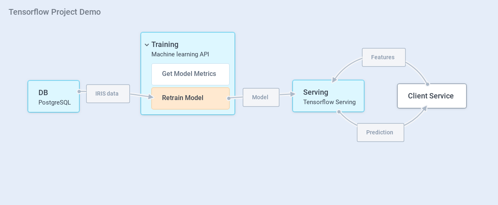
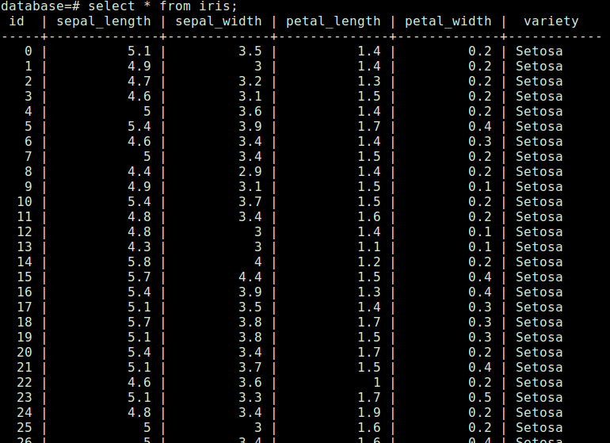
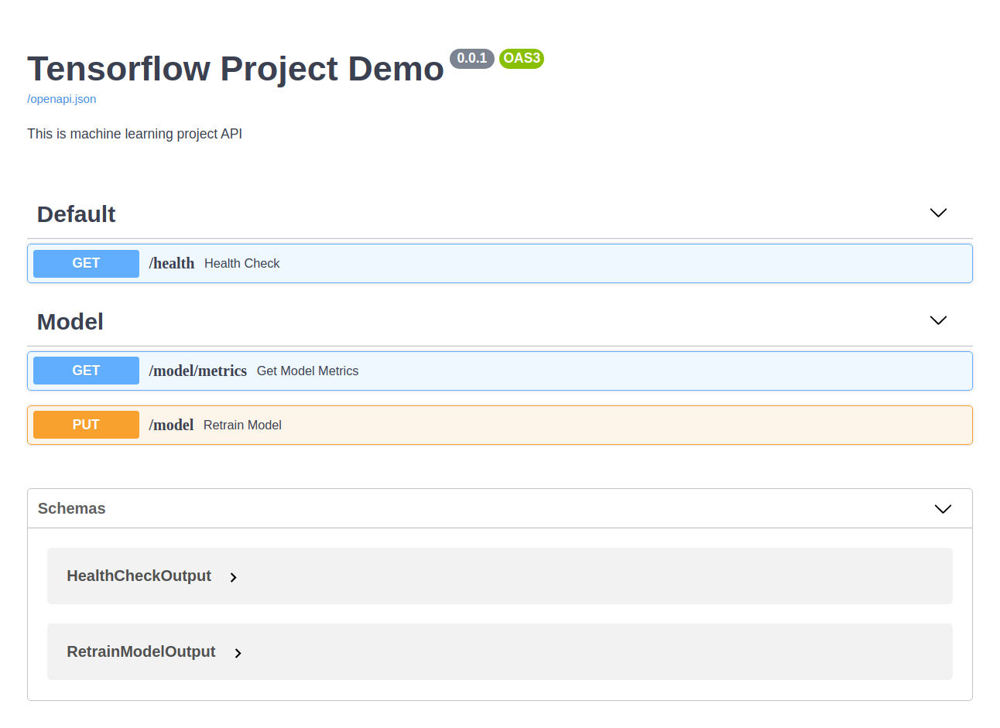
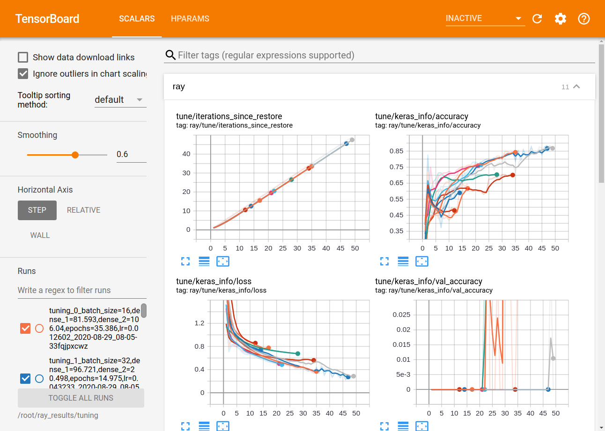

# Tensorflow-Project-Demo

For this project, I used the classic datasets iris to do the project demo. My personal goal for this project is to not only explore the data and build models, but to also build an API server with retrainable model. To achieve this goal, I used fastapi, tensorflow and ray tune.

The project contain three services `db`, `serving` and `training`. When you train the model. the `training` module will query the `db` to get the iris data and start training the model. After the training process finish, it will give the model to `serving`. So that any client service can  connect to serving to get the prediction with given features.

Also, I decided to develop this project to be the same as how data-related projects are developed in real-world scenarios, wherein the end goal of development is a project that is feasible for production. Therefore, I have put efforts on creating:

1. Exploratory Data Analysis (EDA) in the `notebooks/` folder;
2. An API Server inside the `api/` folder;
3. Files for deployment such as Dockerfile and docker-compose.yml;
4. Documentations in the `docs/` folder; and
5. Some necessary scripts in `scripts/` folder; and
6. Configurations, included hyperparameters space in `config.py`.

In the tensorflow part, I used very powerful tools:

1. tfrecord
2. tensorboard
3. tensorflow serving

for building the project. 

I have another project use lightgbm as the back bone model. Toke a look about the project [**lightgbm-project-demo**](https://github.com/raywu60kg/lightgbm-project-demo) 

## Services
I have three services: `db`, `serving` and `training`.

### Database
I use the PostgreSQL as this demo's database. After you run all the service `Training` will initial the database, then you can check the data in the database.
```
docker-compose exec db psql -d database -U user
select * from iris;
```


### Training
The training service is a machine learning API that is open on port 8000. I used fastapi for the API server, so you can check it on **http://localhost:8000/docs** after you run the `training` service. The hyperparameters search space is in the `src/config.py` so you can change them if you want.


### Serving
I use `Tensorflow Serving` to build the prediction server. It is a very powerful tools amount TensorFlow Extended (TFX) . See more detail on [tensorflow document.](https://www.tensorflow.org/tfx/serving/api_rest)

## How to run this demo

### 1. Install requirement
- docker
- docker-compose

### 2. Build the image
```
make build
```
### 3. Start the services
```
docker-compose up -d
```

### 4. Try to update the model
```
curl -X PUT "http://localhost:8000/model" -H  "accept: application/json"
```

## 5. Check Training Result

### 5.1 Activate tensorboard
```
docker-compose exec training make activate-tensorboard
```


### 5.2 Check the Result
Turn on your browser and go to **http://localhost:6006/**


## 6. Let's make some prediction
Feel free to change the number from 0 to any number you want
```
curl -X POST "http://localhost:8501/v1/models/tensorflow-project-demo:predict" 
-H  "accept: applicationjson"
-d 
'{
    "inputs":{
        "sepal_length":[[0]],
        "sepal_width":[[0]],
        "petal_width":[[0]],
        "petal_length":[[0]]
    }
}' 
```
The response will be like:
```
{
    "outputs": [
        [
            0.607119262,
            0.392192692,
            0.000688050292
        ]
    ]
}
```

The output means the estimation in probability of categories Setosa,  Versicolor and Virginica respectively.

## Note
If you want to change the model structure, you can change the `model.py`. Also, If you want to change the hyperparameters search space, you can go to `config.py`.

 About the hyperparameter search algorithm, I am using the random search for this demo but if you want to try other searching algorithm, you can change `train.py`.

## Here are some documentations
[How to set up the working environment for this project](docs/dev_mode.md)

[API example](docs/api_example.md)

## Reference
- [Data science project folder Structure](https://dzone.com/articles/data-science-project-folder-structure)

- [Cookiecutter: Package for generate data science project](https://github.com/drivendata/cookiecutter-data-science)

- [Ray tune example](https://colab.research.google.com/github/ray-project/tutorial/blob/mastertune_exercises/exercise_1_basics.ipynb)